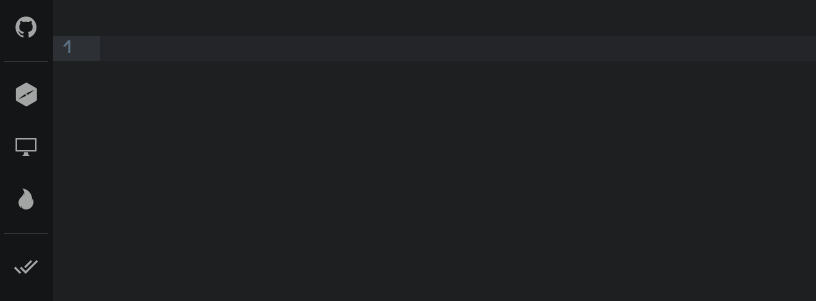

# atom-pg-formatter

A PostgreSQL SQL syntax formatter for [Atom](https://atom.io/).



> Atom integration for the [`pg-formatter`](https://github.com/gajus/pg-formatter), which is a Node.js wrapper of [`pgFormatter`](https://github.com/darold/pgFormatter).

## Features
* Format selected text or a whole file via keyboard shortcut or command.
* Format SQL files on save.

## Installation
Search for `pg-formatter` in Atom UI.

Or get it via command line:

```
apm install pg-formatter
```

## Usage
Hit `Ctrl-Alt-F` to format selected text (or a whole file).

Or define your shortcut:

```cson
'ctrl-alt-p': 'pg-formatter:format'
```

Also, you can automatically format SQL files on save (disabled by default).

## Configuration
See [pg-formatter](https://github.com/gajus/pg-formatter) options.

You can enable formatting SQL files on save. By default package formats files within `source.sql` scope, but you can configure it via package settings.

> Use `Editor: Log Cursor Scope` command to find out a scope for a current file.
